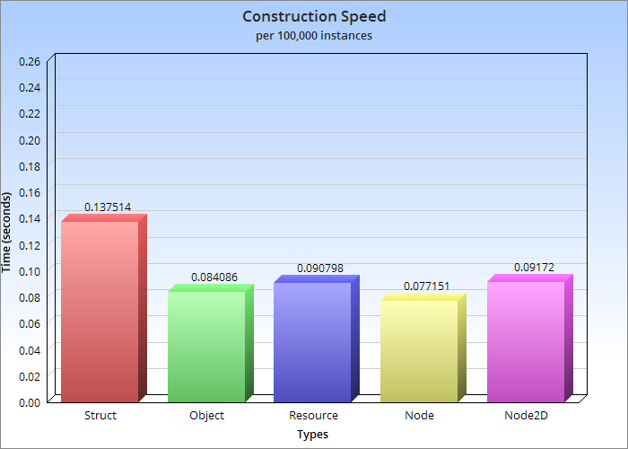
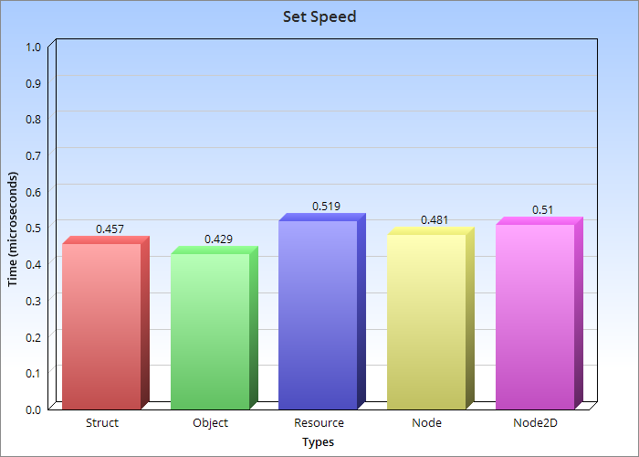
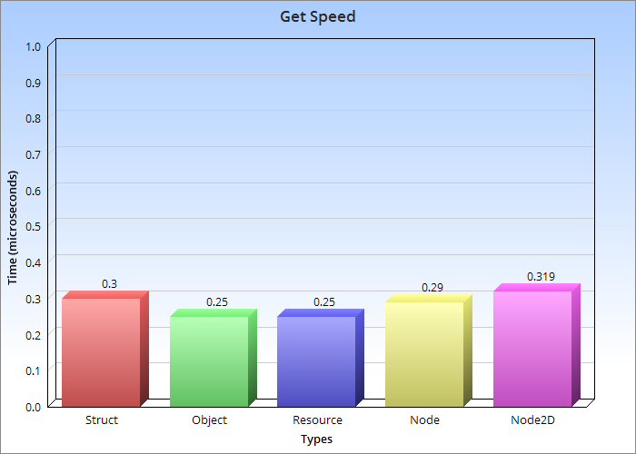

# BaseStruct Class

## Overview

The `BaseStruct` class is an extendable `Resource` implementing Godot's server/resource pattern to provide highly memory optimized and type safe structs. Data is distributed into <Type>PackedArrays and is accessed through the structs index, which doubles as its unique ID. This convention allows for very fast lookups, on par with Godot's internal Classes, while maintaining a memory footprint more then 25x smaller then an identical `Object` and more then 35x smaller then an identical `Node2D`. See [Benchmarks](#benchmarks) for results.

## Features

### Type Safety
Data is kept in typed arrays. The default getter and setter use the `Variant` type. To Rigidly enforce type safety, extend the class and implement typed getters and setters for each property:
```
class_name SpatialStruct extends BaseStruct

func _init():
    add_property("position", DataType.Vector3, Vector3.ZERO)

func set_position(instance_id: int, value: Vector3) -> void:
    set_value("position", instance_id, value)

func get_position(instance_id: int) -> Vector3:
    return get_value("position", instance_id)
```
[Full Example](test/test_struct.gd)

To improve speeds, skip the overhead of the extra function call and interact with the data directly.
```
func set_position(instance_id: int, value: Vector3) -> void:
    _data["position"][instance_id] = value

func get_position(instance_id: int) -> Vector3:
    return _data["position"][instance_id]
```

### Signals
Like `Resource`, Structs offer a `changed` signal.
```
var struct := BaseStruct.new()
var instance_id := struct.instance()

struct.changed_connect(instance_id, _my_callback_function)
struct.changed_disconnect(instance_id, _my_callback_function)
```

### Memory Efficiency
The primary use case for this class is reducing memory usage when using thousands, hundreds of thousands or even millions of objects. See [Benchmarks](#benchmarks) for results.

### Serialization
The class extends `Resource`, and is designed to be able to easily save and load your entire collection of struct instances.

## Usage

### Defining Properties
Properties are defined through the `add_property` method.
```
var struct := BaseStruct.new()
struct.add_property("name", BaseStruct.DataType.String, "MyStruct")
```

### Creating and Deleting Instances
Creating new instances is straightforward, and the constructor method returns the id of the instance.
```
var struct := BaseStruct.new()

# Create a new instance
var instance_id: int = struct.instance()

# Delete the instance
struct.delete(instance_id)
```

### Getting and Setting instance values
```
var struct := BaseStruct.new()
struct.add_property("name_of_property", BaseStruct.DataType.String, "value_of_property")
var instance_id: int = struct.instance()

struct.set_value("name_of_property", instance_id, "updated_value")
struct.get_value("name_of_property", instance_id) # Returns "updated_value"
```

## Benchmarks

### Hardware
- ***CPU:*** Apple M2
- ***Memory:*** 8gb

### Source
[Test Functions](test/test.gd) | [Data](test/benchmarks.txt)

### Memory Usage


### Construction Speed

NOTE: using the batch_instance method brings construction speeds down to 0.032 seconds per 100,000 instances

### Property Set Speed


### Property Get Speed

