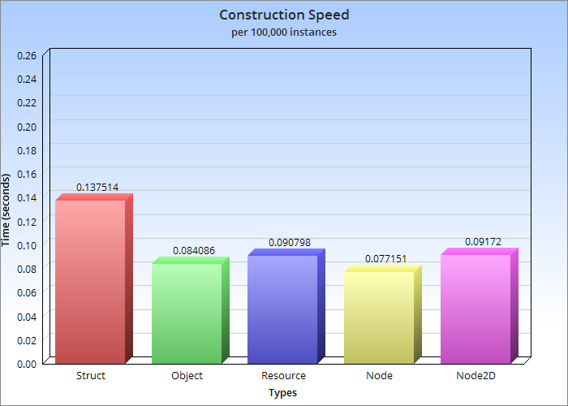
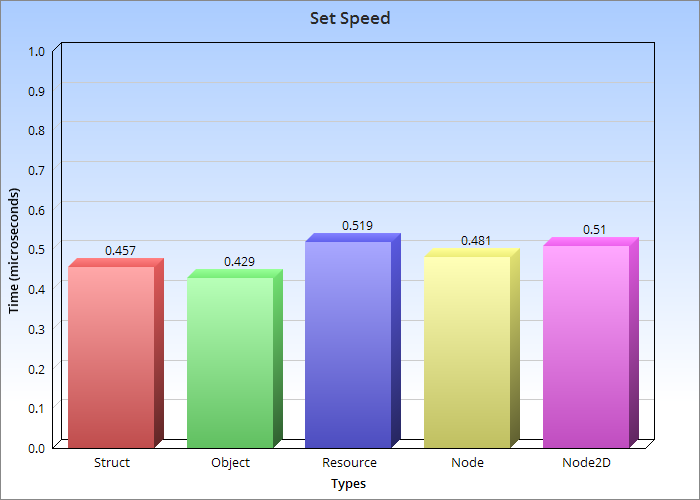
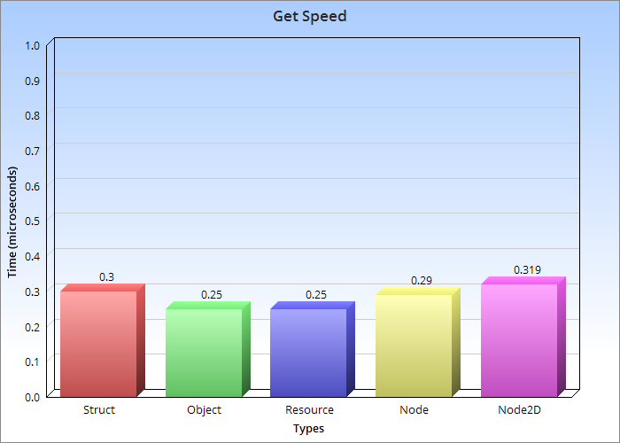

# BaseStruct Class

## Overview

The `BaseStruct` class is an extendable `Resource` designed to handle structured data in a flexible and efficient manner. This class allows for dynamic property management and provides methods for instance manipulation, property setting/getting, and default value handling.

## Features

### Type Safety
Data is kept in typed arrays. The default getter and setter use the `Variant` type. To Rigidly enforce type safety, extend the class and implement typed getters and setters for each property:
    ```
    class_name SpatialStruct extends BaseStruct

    func _init():
        add_property("position", DataType.Vector3, Vector3.ZERO)

    # Simplest implementation
    func set_position(instance_id: int, value: Vector3) -> void:
        set_value("position", instance_id, value)

    func get_position(instance_id: int) -> Vector3:
        return get_value("position", instance_id)

    # To improve speeds somewhat, skip the overhead of the extra function call and update the data directly.
    func set_position_faster(instance_id: int, value: Vector3) -> void:
        _data["position"][instance_id] = value

    func get_position_faster(instance_id: int) -> Vector3:
        return _data["position"][instance_id]
    ```

### Memory Efficiency
The primary use case for this class is reducing memory usage when using thousands, hundreds of thousands or even millions of objects. See [Benchmarks](#benchmarks) for results.

### Serialization
The class extends `Resource`, and is designed to be able to quickly serialize and deserialize your entire collection of objects.

## Usage

### Defining Properties
Properties are defined through the `add_property` method.
    ```
    var struct := BaseStruct.new()
    struct.add_property("name", BaseStruct.DataType.String, "MyStruct")
    ```

### Creating and Deleting Instances
Creating new instances is straightforward, and the constructor method returns the id of the instance.
    ```
    var struct := BaseStruct.new()

    # Create a new instance
    var instance_id: int = struct.instance()

    # Delete the instance
    struct.delete(instance_id)
    ```

### Getting and Setting instance values
    ```
    var struct := BaseStruct.new()
    struct.add_property("name_of_property", BaseStruct.DataType.String, "value_of_property")
    var instance_id: int = struct.instance()

    struct.set_value("name_of_property", instance_id, "updated_value")
    struct.get_value("name_of_property", instance_id) # Returns "updated_value"
    ```

## Benchmarks

### Hardware
-***CPU:*** Apple M2
-***Memory:*** 8gb

### Source
[Test Functions](test.gd)|[Data](benchmarks.txt)

### Memory Usage


### Construction Speed


### Property Set Speed


### Property Get Speed

